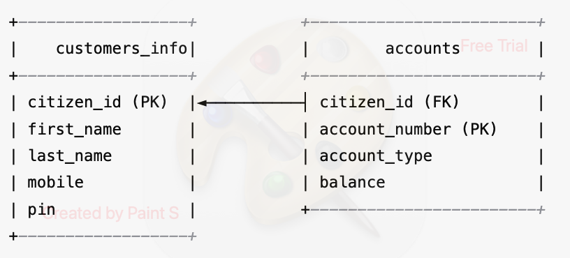

# Corebanking Hackathon Project

## Project Description

A simplified core banking system created for a hackathon. The system provides basic account and customer functionalities with database integration and is containerized using Docker.

**Time spent**: ~6 hours
- 1 hour for design
- 1 hour for writing documentation
- 4 hours for coding (including scripts and Docker setup)

## How to Run

This project uses Docker Compose to manage services. Run the following command in the project root directory:

```bash
docker compose up --build
```

### This will start two containers:

- **Spring Boot App** – Main backend application with core banking features
- **Postgres Database** – Database service used by the application

> ⚠️ **Note**: In real-world production, additional components like **Redis** (for caching), **Kafka** (for messaging), and an **API Gateway** would be needed for scalability and resilience.

## Testing

### 1. Unit Tests

Run unit tests using Maven:

```bash
mvn test
```

### 2. Postman API Testing

A Postman collection and runner sequence is provided for easy API testing.

You can find them under:

```
/Postman_Collection
```

Import the collection and runner into Postman to simulate and test all API scenarios.

## Documentation

All diagrams and related documents are available in the following directory:

```
/Documents
```

## ER Diagram




---

### Final Note

Please note that I completed this challenge within the 6-hour time limit. There are several areas I would have covered with more time, such as:

1. Core banking application detailed diagram
2. Component and technology stack explanation
3. Statement API implementation
4. Robot Framework scripts for API testing

